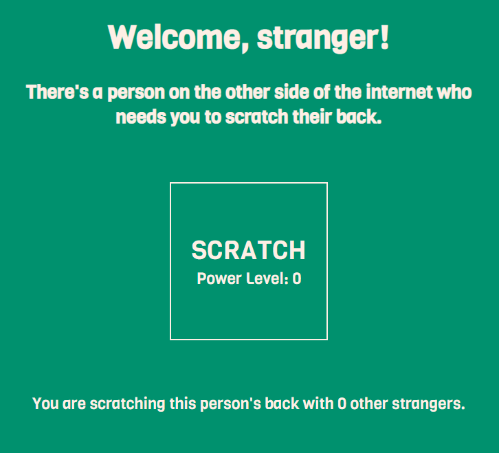

# The Backscratcher

## Video

TO BE ADDED (Unfortunately forgot to record footage of the experience, am working on that)

## Context

I was inspired by a part of [this wonderful invention](https://spongebob.fandom.com/wiki/Automatic_Back_Scratcher,_Hair_Comber,_Nose_Picker,_and_Ukulele_Tuner_9000); however, I wanted my backscratcher to be powered by the Internet. I figured that since I was rather lazy, it would be nice to have my friends scratch my back over the Internet for me. To incentivize these friends and prevent them from slacking off, I decided that I would turn their portion of the backscratching job into a collaborative minigame to retain their engagement in the activity.

## Objective

For the people whose job is to scratch my back remotely, they will be placed in front of a website. Their goal with this website is to click on the button in the center of the screen as fast as possible to increase the power level. The power level increases based on the speed of the clicks; as each person increases their 

## Process

Documentation of my process can be found in [`journal.md`](journal.md). The circuit schematic for the hardware portion of my schematic is included in this journal.

A recurring problem I had to grapple with was the fundamentally different behaviors between Arduino, Processing, and Node.js. Although the Processing to Node.js portion of the project was relatively easy/without issue, it was trying to reconcile the asynchronous nature of Processing with the synchronous nature of Arduino that gave me many troubles. However, shifting a majority of the computation from Arduino to Processing and implementing a more robust messaging system made this issue much easier to manage.

Another smaller issue was that Arduino was having difficulties keeping up with the amount of messages that Processing was relaying across the serial bus. I would run into an issue where the Arduino, when unable to keep up, would simply disconnect from the serial bus. However, this was more or less solved by having Processing filter the values before sending them across the serial bus.

## Personal Review

Surprisingly, the backscratching is quite comfortable. It's not exactly the same as an actual person scratching my back, but by adjusting the harness straps, I am able to hit different parts of my back. The friends I employed to scratch my back also found the minigame portion rather entertaining, and overall the experience was a fun bonding time for all of us.
