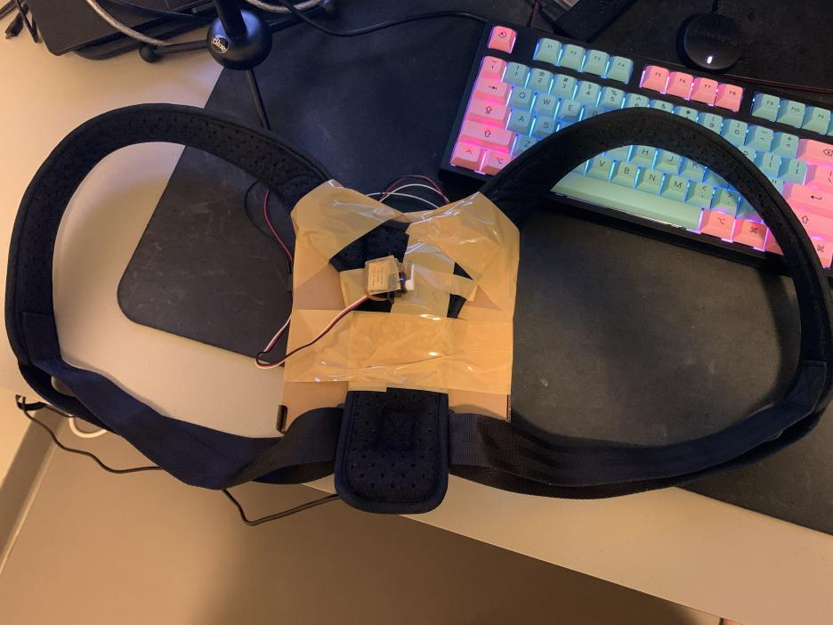

# Development Journal

## Concept

For this project, I want to have some sort of publicly-accessible webserver that interfaces with Processing, which then interfaces with Arduino. The idea is that people can access the frontend for the webserver and enter an input of some sort. The server would route the input to Processing, which would then route the input from Processing to the Arduino via serial communication. The Arduino would then interpret the input and act accordingly. In this case, Processing would not necessarily be a visual focus but rather a middleman between the server and the Arduino. At its most ambitious form, I would like to implement a "shell" or "terminal" style of input, allowing users extensive control of the Arduino. However, I would like to keep my options open in terms of final circuitry and leave that to self-experimentation.

## October 5

I worked the server and started on the code for Processing and Arduino. At this point, my plan is to offload the graphics to the frontend website so that Processing can focus on bridging the connection between the Arduino and the server. The current plan is to have websockets between the server and website, and standard HTTP GET/POST requests between the server and Processing.

## October 6

As it turns out, I can just use websockets for everything since Processing has its own easy-to-use websocket implementation. This means that the potentially large volumes of HTTP requests sent between Processing and the server will not happen, making it easier for me to host it on my own website. I've moved onto the Processing code to connect it to the server.

## October 8

I worked on the Arduino code/circuitry. The Arduino will connect to Processing via the serial bus. From preliminary tests, it appears to work nicely, but I'll have to test the code with more people to see whether it can handle heavier loads of data.

## October 9

I grabbed an old back-brace which I had lying around as the harness. I took a cardboard box which I also had lying around and strapped the circuitry into the box. I then applied extensive amounts of packing tape to secure the box to the harness. It's relatively secure, but I've been treating it with care to prevent it from falling apart. I've also begun testing the program out with more people; I had 6 friends in a call help me debug and test the power system and tweak it to make it require more effort. The main change to the power system was to 1) make the power decrease after a time *per click* rather than having each click reset the time before the power level decreases. In addition, the time before decrease is scaled as the number of players increases, requiring each person to contribute to the power system to properly increase the power level to maximum.

I also polished the UI to be more clean and react to changes in power level; there is a jitter of UI elements that increases as the power level increases.
