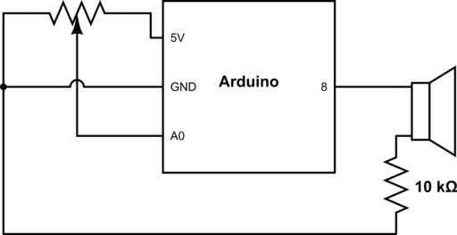

# Musical Instrument

[DEMO](https://streamable.com/mewh84)



For this project, I decided to play around with two-way interfacing between Arduino and Processing. The reason I went this route was so I could use keypresses inputted into Processing, which would then be sent via serial port to Arduino for conversion into a tone. On the breadboard, I wired up a potentiometer which can be used to create finer adjustments/tunings of pitch (e.g. for vibrato). This instrument has a 30-note chromatic range which corresponds to a majority of the standard QWERTY keyboard. It is also quite easy to extend the instrument to react to other keys for modification.

Formula to convert from note (relative to A4) to tone (Hz):

```
2 ^ (n / 12) * 440
```
