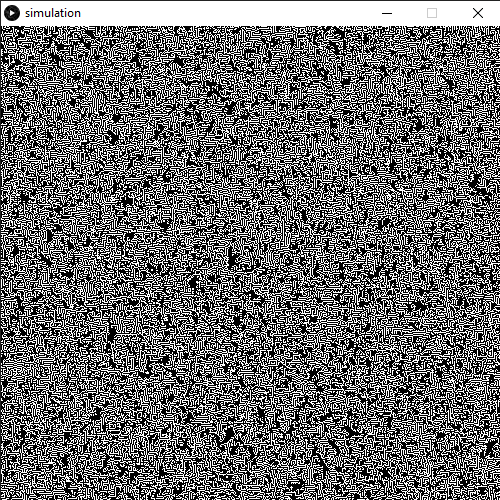

# Conway's Game of Life

During the production of this work, I was messing around with cellular automata, specifically Conway's Game of Life. The premise behind GoL is that cells (akin to people or organisms) inhabit a grid. To determine if each cell is dead or alive during each generation:

1. If a live cell has 2 or 3 live neighbors, it survives.
2. If a dead cell has 3 live neighbors, it becomes alive.
3. Otherwise, the cell dies/stays dead.

In my implementation, live cells are white and dead cells are black. `Spacebar` pauses the simulation, and `f` while paused steps the simulation forward one generation.

While playing around with my GoL implementation, I found that if I densely pre-populated the grid and "wrapped" the grid (effectively creating a globe effect), the result was a hypnotizing combination of maze patterns and water-like ripples.
